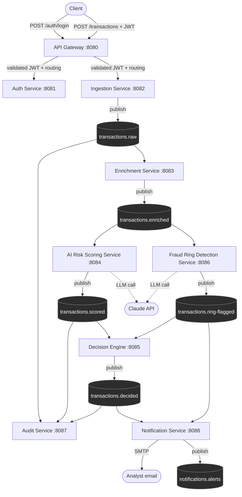

# RingWatch

**AI-Augmented Real-Time Fraud & Fraud-Ring Detection Platform**

RingWatch ingests financial transactions in real time, enriches them with historical context,
scores them for fraud risk using an LLM, detects organized fraud rings using graph algorithms,
and routes decisions to an audit trail and analyst notifications — all wired together with Kafka
and observed with OpenTelemetry, Prometheus, and Grafana.

It's a portfolio project combining backend engineering (Spring Boot microservices, Kafka,
resilience patterns), classic computer science (hand-rolled Union-Find, BFS, min-heap, LRU cache,
sliding-window rate limiter), and applied AI (LLM-based risk scoring and fraud-ring explanation),
built one vertical slice at a time.

## Architecture



Every arrow into/out of a `(topic)` node is Kafka (async, at-least-once, partitioned by
account/transaction ID for per-account ordering). Everything else is synchronous REST, routed
through the API Gateway, which validates JWTs and applies a hand-rolled sliding-window rate
limiter before forwarding identity downstream via `X-User-Id`/`X-User-Role` headers.

`transactions.enriched` fans out to two **independent** consumers (AI Risk Scoring and Fraud Ring
Detection) — they don't depend on each other, and the Decision Engine combines both of their
outputs (risk score + ring membership) into one APPROVE/FLAG/BLOCK decision.

### Services

| Service | Port | Responsibility | Type |
|---|---|---|---|
| API Gateway | 8080 | Routing, JWT validation, custom sliding-window rate limiting | Spring Cloud Gateway (reactive) |
| Auth Service | 8081 | Analyst accounts, login, JWT issuance | REST |
| Ingestion Service | 8082 | Accepts transactions, dedupes, publishes to Kafka | REST + Producer |
| Enrichment Service | 8083 | Attaches historical account context via a custom LRU cache | Consumer + Producer |
| AI Risk Scoring Service | 8084 | Calls Claude for a 0–1 fraud risk score + explanation, falls back to rule-based scoring | Consumer + Producer + outbound REST |
| Decision Engine | 8085 | Combines risk score + ring membership into APPROVE/FLAG/BLOCK, prioritized via a min-heap | Consumer + Producer + DB |
| Fraud Ring Detection Service | 8086 | Union-Find account clustering + BFS cycle detection, LLM explanation of detected rings | Consumer + Producer + outbound REST |
| Audit Service | 8087 | Immutable event log + compliance query API | Consumer + REST + DB |
| Notification Service | 8088 | Email alerts on FLAG/BLOCK/new rings, publishes in-app alert events | Consumer + outbound SMTP |
| common-lib | — | Shared Kafka event schemas, topic names, JWT validation | Library (no service) |

### DSA centerpieces

Every service that needed a nontrivial data structure or algorithm has one **hand-rolled**
(no library) as a deliberate demonstration of the underlying CS, not because a library equivalent
doesn't exist:

| Component | Data structure / algorithm | Where |
|---|---|---|
| Enrichment cache | LRU cache (HashMap + doubly linked list) | Enrichment Service |
| Rate limiting | Sliding-window log (deque-based) | API Gateway |
| Decision prioritization under load | Min-heap priority queue | Decision Engine |
| Fraud ring clustering | Union-Find (disjoint set, path compression + union by rank) | Fraud Ring Detection Service |
| Circular fund movement detection | BFS cycle detection over a directed transaction graph | Fraud Ring Detection Service |

### Resilience

Every outbound call to an unreliable external dependency is wrapped in
[Resilience4j](https://resilience4j.readme.io/):
- **AI Risk Scoring Service** and **Fraud Ring Detection Service** → Claude API: retry + circuit
  breaker + fallback (rule-based scoring / a templated explanation).
- **Notification Service** → SMTP: retry + fallback (log and move on — a struggling mail server
  never blocks the Kafka consumer thread).

### Observability

Every service exports metrics (Micrometer → Prometheus) and traces (OpenTelemetry → OTLP → Jaeger).
See [Observability](#observability-1) below for how to view them.

## Prerequisites

- Java 21
- Maven 3.9+
- Docker Desktop (for Postgres, Kafka, Jaeger, Prometheus, Grafana)

## Running it locally

### 1. Start the infrastructure

```bash
docker compose up -d
```

This brings up:

| Container | Purpose | URL |
|---|---|---|
| `ringwatch-postgres` | One database per service that needs one | `localhost:5432` |
| `ringwatch-kafka` | Single-node KRaft broker | `localhost:9092` |
| `ringwatch-jaeger` | Trace collection + UI | http://localhost:16686 |
| `ringwatch-prometheus` | Metrics scraping | http://localhost:9090 |
| `ringwatch-grafana` | Dashboards (Prometheus pre-provisioned as a datasource) | http://localhost:3000 (`admin`/`admin`) |

Services run on the **host**, not in containers — Prometheus reaches them via
`host.docker.internal`, the same way every service reaches Postgres/Kafka via `localhost`.

### 2. Set environment variables

```bash
export JWT_SECRET="a-dev-secret-at-least-32-bytes-long-for-hs256"
export RINGWATCH_ADMIN_PASSWORD="pick-a-password"
export ANTHROPIC_API_KEY="sk-ant-..."   # optional — omit to always use the rule-based fallbacks
```

| Variable | Required by | Default |
|---|---|---|
| `JWT_SECRET` | api-gateway, auth-service, ingestion-service, audit-service | — (required) |
| `RINGWATCH_ADMIN_PASSWORD` | auth-service | — (required; seeds the initial ADMIN account) |
| `RINGWATCH_ADMIN_USERNAME` | auth-service | `admin` |
| `ANTHROPIC_API_KEY` | ai-risk-scoring-service, fraud-ring-detection-service | empty (LLM calls fail fast → rule-based fallback) |
| `ANTHROPIC_BASE_URL` | ai-risk-scoring-service, fraud-ring-detection-service | `https://api.anthropic.com` |
| `SMTP_HOST` / `SMTP_PORT` | notification-service | `localhost` / `1025` (point at a local catcher like [MailHog](https://github.com/mailhog/MailHog) or Mailpit) |
| `SMTP_USERNAME` / `SMTP_PASSWORD` / `SMTP_AUTH` / `SMTP_STARTTLS` | notification-service | empty / empty / `false` / `false` |
| `RINGWATCH_ALERT_RECIPIENTS` | notification-service | `analyst@example.com` (comma-separated) |
| `OTEL_EXPORTER_OTLP_TRACES_ENDPOINT` | every service | `http://localhost:4318/v1/traces` (Jaeger, from the compose stack above) |

### 3. Build and run the services

```bash
mvn -pl common-lib install -DskipTests   # build the shared library first
mvn -pl <service-name> spring-boot:run   # one terminal per service, e.g.:
mvn -pl auth-service spring-boot:run
mvn -pl ingestion-service spring-boot:run
mvn -pl api-gateway spring-boot:run
mvn -pl enrichment-service spring-boot:run
mvn -pl ai-risk-scoring-service spring-boot:run
mvn -pl decision-engine spring-boot:run
mvn -pl fraud-ring-detection-service spring-boot:run
mvn -pl audit-service spring-boot:run
mvn -pl notification-service spring-boot:run
```

There's no fixed startup order requirement — every consumer just waits for messages on its topic,
and Kafka retains them until consumed.

### 4. Try it

```bash
# Log in and grab a token
TOKEN=$(curl -s -X POST http://localhost:8080/auth/login \
  -H 'Content-Type: application/json' \
  -d '{"username":"admin","password":"'"$RINGWATCH_ADMIN_PASSWORD"'"}' | jq -r .token)

# Submit a transaction through the gateway
curl -X POST http://localhost:8080/transactions \
  -H "Authorization: Bearer $TOKEN" -H 'Content-Type: application/json' \
  -d '{"transactionId":"tx-1","senderAccountId":"acct-A","receiverAccountId":"acct-B",
       "amount":100.00,"currency":"USD","deviceId":"dev-1","ipAddress":"10.0.0.1",
       "timestamp":"2026-01-01T00:00:00Z"}'

# Watch it flow through the pipeline
curl -H "Authorization: Bearer $TOKEN" http://localhost:8087/audit/tx-1
```

### Observability

- **Jaeger** (http://localhost:16686) — pick a service, find a trace, see the request cross every
  hop it touched.
- **Prometheus** (http://localhost:9090/targets) — confirm every service shows `UP`.
- **Grafana** (http://localhost:3000) — the Prometheus datasource is pre-provisioned; build a
  dashboard against any of the scraped `job` labels (one per service).

### 5. Run the dashboard

With `api-gateway`, `auth-service`, and `audit-service` running (step 3 above):

```bash
cd dashboard-ui
npm install
npm run dev   # http://localhost:5173
```

Log in with the seeded admin account (`admin` / `$RINGWATCH_ADMIN_PASSWORD`). See
[dashboard-ui/README.md](dashboard-ui/README.md) for what's built vs. still planned.

## Testing

```bash
mvn test
```

Every module is covered by unit tests plus Kafka integration tests against `@EmbeddedKafka` (and
WireMock/GreenMail for outbound LLM/SMTP calls), so the full suite runs without Docker. Run a
single module with `mvn -pl <module> -am test` (the `-am` flag is required whenever `common-lib`
has changed, so Maven rebuilds it from source instead of using a stale local copy).

## Repository structure

```
ringwatch/
├── common-lib/                    shared Kafka event schemas, topic names, JWT validation
├── auth-service/
├── ingestion-service/
├── api-gateway/
├── enrichment-service/
├── ai-risk-scoring-service/
├── decision-engine/
├── fraud-ring-detection-service/
├── audit-service/
├── notification-service/
├── dashboard-ui/                  analyst frontend (Vite/React, not a Maven module)
├── docker/
│   ├── initdb/                    per-service database creation scripts
│   ├── prometheus/                scrape config
│   └── grafana/provisioning/      datasource auto-provisioning
└── docker-compose.yml             Postgres, Kafka, Jaeger, Prometheus, Grafana
```

## Status

Phases 1–4 (foundations, core pipeline, fraud-ring detection, audit/notification/observability)
are complete. Phase 5 (analyst dashboard UI) is in progress — the shell, login, and live
transaction feed are built (`dashboard-ui/`); the review queue, override action, and fraud ring
graph are follow-up slices. Phase 6 (Testcontainers, reconciliation job, load testing) is next.
